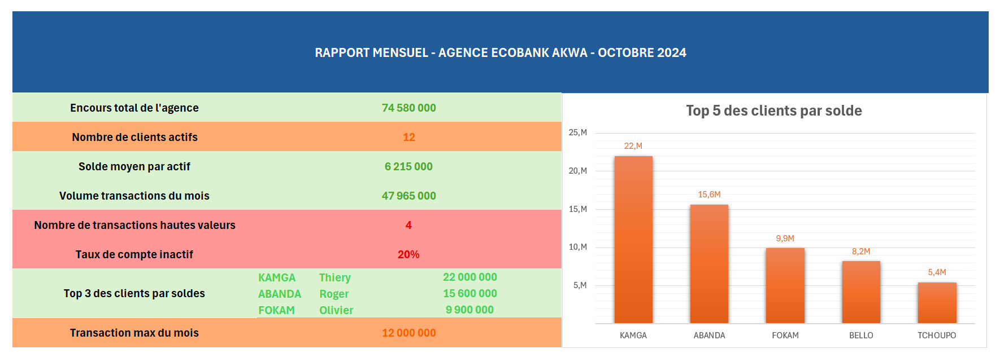

# Excel Banking Analysis — Douala Agency Monthly Report


---

## Project Overview

This project simulates a **real-world data analyst mission** in a commercial bank environment based in **Douala, Cameroon**. It demonstrates the ability to clean, structure, analyze, and visually present financial data using Microsoft Excel — from raw client data to a polished executive dashboard.

> **Context:** As a junior data analyst intern at a fictional branch of a Cameroonian bank (Ecobank Akwa — Douala), I was tasked with producing the **monthly activity report for October 2024**, to be presented to the branch director.

---

## Business Problem

The branch manager needed clear, actionable answers to three questions every Monday morning:

1. **How is our client portfolio performing?** *(balance distribution, account types, active vs inactive)*
2. **Where are the financial risks?** *(accounts with low or zero balances, inactive clients)*
3. **What decisions should be made?** *(client segmentation, priority actions)*

---

## Project Structure

```
excel-banking-analysis/
│
├── data/
│   ├── clients_raw.xlsx          # Raw client data (15 clients, intentional errors)
│   └── transactions_oct2024.xlsx # 20 transactions for October 2024
│
├── output/
│   └── Rapport_Mensuel_Akwa_Oct2024.xlsx  # Final deliverable (5 sheets)
│
├── screenshots/
│   ├── dashboard_preview.png     # Executive dashboard screenshot
│   └── data_cleaning_log.png     # Data quality audit log
│
└── README.md
```

---

## Skills Demonstrated

### Data Cleaning
| Technique | Applied To |
|-----------|-----------|
| `SUPPRESPACE()` | Remove leading/trailing spaces from client names |
| `NOMPROPRE()` | Standardize name capitalization |
| `SUBSTITUE()` | Fix inconsistent date formats (MM-DD vs DD/MM) |
| `SI(ESTVIDE())` | Flag and handle missing revenue values |
| Duplicate removal | Remove exact duplicate client records |

### Data Analysis
| Formula | Purpose |
|---------|---------|
| `SOMME`, `MOYENNE`, `MIN`, `MAX` | Portfolio-level KPIs |
| `NB.SI`, `SOMME.SI` | Count/sum by category (active accounts, account type) |
| `SI` nested (3 levels) | Client segmentation by balance: *Empty / Low / Medium / High* |
| Auto-filter + Multi-sort | Extract clients by agency and balance range |

### Visualization & Reporting
- **Pivot Table (TCD)** — transactions by type, by week, by channel
- **Conditional formatting** — color-coded risk levels (green / orange / red)
- **Slicers** — interactive filtering by agency and account type
- **Executive Dashboard** — single-page printable report, no gridlines, 8 KPIs

---

## Key Findings

After cleaning and analyzing the dataset of **15 clients and 20 transactions**:

- **Total portfolio balance:** 74,580,000 FCFA
- **Active accounts:** 12 out of 15 (80%)
- **Inactive accounts:** 3 (including 1 zero-balance account flagged for review)
- **Top 3 clients** account for **64%** of total deposits
- **High-value transactions (> 5M FCFA):** 4 flagged for compliance review
- **Most active channel:** Web banking (45% of transaction volume)

> **Insight:** The portfolio shows a high concentration risk — the top 3 clients hold the majority of deposits. A diversification strategy targeting the Standard segment is recommended.

---

## Deliverable — Final Report Structure

The output file `Rapport_Mensuel_Akwa_Oct2024.xlsx` contains **5 sheets**:

| Sheet | Content |
|-------|---------|
| `Base_Clients` | Cleaned client database (15 records, 0 errors) |
| `Transactions` | 20 October transactions with analysis columns |
| `journal_nettoyage`| Data quality audit log : 6 anomalies detected & corrected, before/after metrics (5+ KPIs), validation rules, sign-off |
| `Calculs_KPI` | All formulas — SOMME.SI, NB.SI, averages, segmentation |
| `Dashboard` | Executive one-page visual report for management |

---

## Dashboard Preview

> **

---

## How to Open

1. Download `Rapport_Mensuel_Akwa_Oct2024.xlsx` from the `output/` folder
2. Open with **Microsoft Excel 2016+** or **Excel 365** (recommended)
3. Enable editing if prompted
4. Start from the `Dashboard` sheet for the executive summary
5. Navigate to `Base_Clients` to explore the cleaned dataset

> **Note:** All data in this project is **entirely fictional**. Names, balances, and transactions were created for educational purposes only, inspired by the real banking environment of Douala, Cameroon.

---

## Learning Context

This project is **Level 1** of a structured Data Analyst training program designed to reach an international junior data analyst standard. It covers the foundational Excel skills required for a banking internship.

**Training Roadmap:**
- ✅ **Level 1** — Excel Foundations: data cleaning, formulas, pivot tables, dashboard *(this project)*
- 🔄 **Level 2** — Excel Advanced: VLOOKUP/XLOOKUP, INDEX/MATCH, financial analysis (VPM, NPV, IRR)
- ⏳ **Level 3** — Power Query + Advanced Analysis
- ⏳ **Level 4** — SQL + Python Analytics
- ⏳ **Level 5** — Power BI + Storytelling with Data

---

## About the Author

**[Oyono Zeh Johann Bertrand]**
Data Analyst & AI Engineer — Douala, Cameroon
Master 1 in Data Science & Artificial Intelligence (GISDIA)

- 📧 [https://johannkisa@gmail.com]
- 🐙 [https://github.com/johannkisa-ctrl]

**Background:** Applied ML research at Camrail (predictive maintenance), data collection & cleaning in commercial operations, Machine Learning instructor. Currently deepening expertise in Excel, SQL, and Power BI for a banking sector internship.

---

## License

This project is open source under the [MIT License](LICENSE).
Data is entirely fictional and created for educational purposes.

---

*⭐ If this project helped you or inspired your own work, consider giving it a star — it helps other junior analysts find this resource.*
